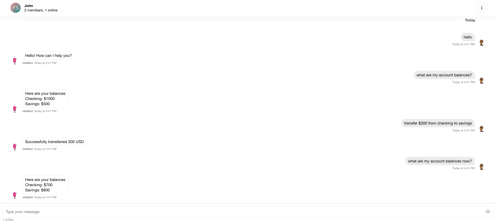
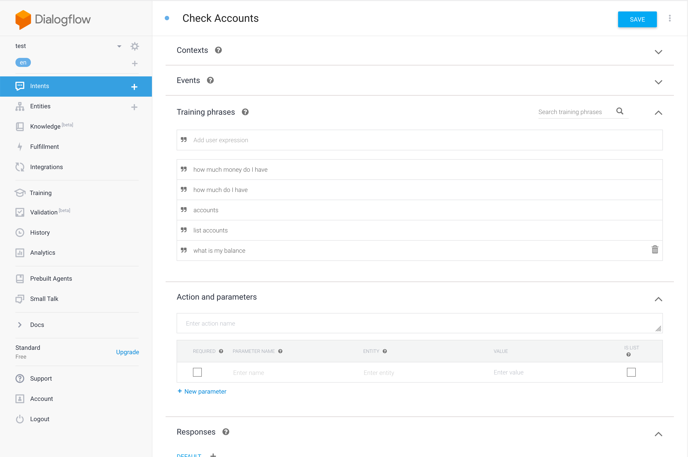
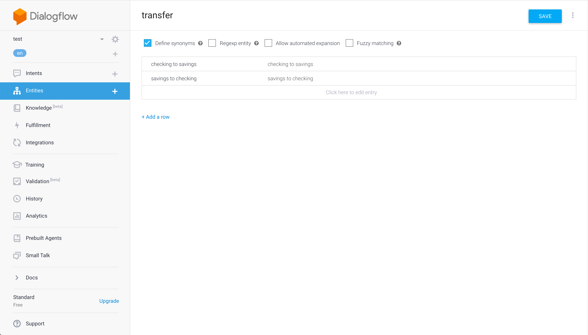
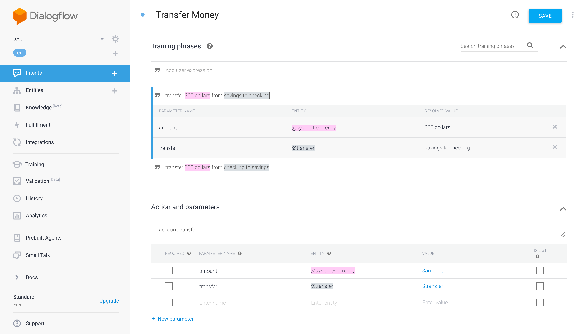
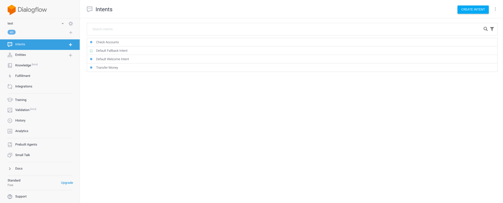
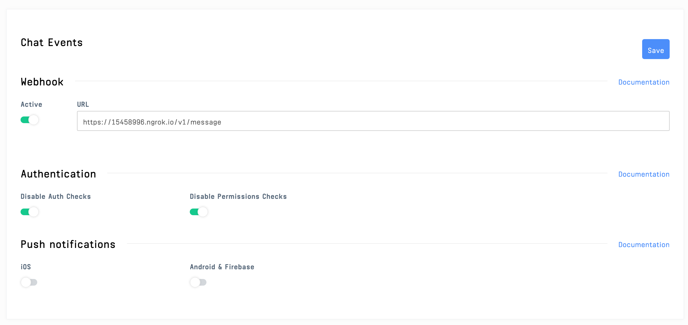
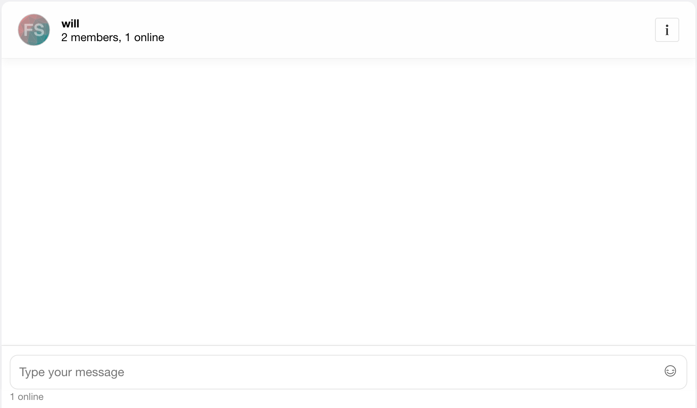

# Building an End-to-End Encrypted Chatbot with Stream React Chat, Virgil Security, and Google Dialogflow

As banking technology advances, secure real-time communication is becoming
increasingly crucial to any modern banking application. It's essential to
provide the technology experiences customers expect while protecting their
privacy and data.

In this tutorial, we will walk through how to create a full, end-to-end
encrypted chatbot solution using [Stream Chat](https://getstream.io/chat/)
combined with [Dialogflow](https://dialogflow.com/) using
[Virgil Security](https://virgilsecurity.com/end-to-end-encrypted-chat) for
encryption. Combining these services allows developers to create a modern
chatbot experience while keeping sensitive information encrypted. The
application embeds Virgil Security's
[eThree Kit](https://github.com/VirgilSecurity/virgil-e3kit-js) with
[Stream Chat React](https://github.com/GetStream/stream-chat-react)'s components
The react app communicates with a backend that uses Stream's webhook integration
and Dialogflow to respond to the user. All source code for this application is
available on [GitHub](https://github.com/psylinse/stream-banking-chatbot).

Stream Chat, Virgil, and Dialogflow make it easy to build a solution with
excellent security with all the features you expect.

## What is end-to-end encryption?

End-to-end encryption means that they can only read messages sent between two
people. To do this, the message is encrypted before it leaves a user's device,
and can only be decrypted by the intended recipient.

Virgil Security is a vendor that will enable us to create end-to-end encryption via
public/private key technology. Virgil provides a platform and JavaScript SDK
that will enable us to create, store, and offer robust end-to-end secure
encryption.

During this tutorial, we will create a Stream Chat app that uses Virgil's
encryption to prevent anyone except the intended parties from reading messages.
No one in your company, nor any cloud provider you use, can read these messages.
Even if a malicious person gained access to the database containing the
messages, all they would see is encrypted text, called ciphertext.

# Building the chatbot

To build this application, we're going to rely on a few libraries,
[Stream React Chat](https://www.npmjs.com/package/stream-chat-react),
[Virgil SDK](https://www.npmjs.com/package/virgil-sdk),
[Virgil Crypto](https://www.npmjs.com/package/virgil-crypto), and [Google
Dialogflow](https://github.com/googleapis/nodejs-dialogflow). Our final product
will encrypt text in the browser before sending a message to Stream Chat. The
encrypted message will be relayed to our backend via Stream's webhooks.
Decryption and verification will happen on the backend before passing it to
Dialogflow for interpretation. Once an
[intent](https://cloud.google.com/dialogflow/docs/intents-overview) has been
determined, the backend performs any necessary actions, encrypts the response,
and relays it via a Stream channel.

Our chatbot will have 3 intents a user can perform, with 1 fallback in case we
don't understand what is said. These are a greeting, check balances, and
transfer money between accounts. Once we're done we'll have a chatbot that's
capable of this:



To accomplish this, the app performs the following process:

* A user authenticates with your backend.
* The user's app requests a Stream auth token and api key from the backend. The
   browser creates a
   [Stream Chat Client](https://getstream.io/chat/docs/#init_and_users) for that
   user.
* The user's app requests a Virgil auth token from the backend and registers
  with Virgil. This generates their private and public key. The private key is
  stored locally, and the public key is stored in Virgil.
* The user joins a
  [Stream Chat Channel](https://getstream.io/chat/docs/#initialize_channel) with
  the chatbot.
* The browser app asks Virgil for chatbot's public key.
* The user types a message and sends it to stream. Before sending, the app
  passes the chatbot's public key to Virgil to encrypt the message. The message
  is relayed through Stream Chat to the backend via a webhook. Stream receives
  ciphertext, meaning they can never see the original message.
* When the backend receives the message, the app decrypts the message using the
  Virgil. Virgil verifies the message is authentic by using the sender's public
  key.
* The backend passes the decrypted text to Dialogflow to determine the user's
  intent. Dialogflow returns a result which contains the information necessary
  for the backend to decide how to respond.
* The backend receives the Diagflow response, decides what action to take, and
  creates the response text.
* Using Virgil, the backend encrypts the response text and responds to the user
  via the Stream Chat Channel. The client decrypts the message.

This looks intimidating, but luckily Stream, Virgil, and Dialogflow do the heavy
lifting for us. As a developer using these services, our responsibility is to
wire them together correctly.

The code is split between the React frontend contained in the `frontend` folder
and the Express (Node.js) backend is found in the `backend` folder. See the
`README.md` in each folder to see installing and running instructions. If you'd
like to follow along with running code, make sure you get both the `backend` and
`frontend` running before continuing.

Let's walk through and look at the important code needed for each step. 

## Prerequisites

Basic knowledge of React and Node.js is required to follow this tutorial. This
code is intended to run locally on your machine.

You will need an account with [Stream](https://getstream.io/accounts/signup/),
[Virgil](https://dashboard.virgilsecurity.com/signup), and
[Google Dialogflow](https://dialogflow.cloud.google.com/). Dialogflow is a
little tricky, so follow the instructions found in their
[nodejs library](https://github.com/googleapis/nodejs-dialogflow) and [how to
authenticate with Google's cloud APIs](https://cloud.google.com/docs/authentication/getting-started) Once
you've created your accounts, place your credentials in `backend/.env`. You can
use `backend/.env.example` as a reference for what credentials are required.

This tutorial uses the following package versions:

* Node 11.14.0
* Yarn 1.17.0
* Stream Chat 0.13.3
* Stream Chat React 0.6.26
* Virgil Crypto 3.2.0
* Virgil SDK 5.3.0
* Virgil e3Kit 0.5.3
* Dialogflow 0.12.2
* Express 4.17.1

Except for `node` and `yarn`, all of these dependencies are declared in 
`backend/package.json` and `frontend/package.json`. 

## Step 1.1 Set up Dialogflow
In order for our chatbot to respond correctly, we need to set up a few
[intents](https://cloud.google.com/dialogflow/docs/intents-overview) and one
[entity](https://cloud.google.com/dialogflow/docs/entities-overview) in our
Dialogflow:

* Add a "Check Accounts" intent. Click on "Intents" in the nav, and click
  "Create Intent". For this intent all we need is a few training phrases that
  indicate what sort of phrase means the user wants to check their account
  balances. Make sure to add some responses in the "Responses" section. This
  intent should look something like this:
  


* Add a "Transfer" entity. Click on "Entities" in the nav, and click "Create
  Entity". Name it "transfer" and create two synonyms, "checking to savings" and
  "savings to checking". This is a very simple intent used for demonstration
  purposes only. Be sure to read up on how to create more sophisticated
  entities:
  


* Now add a "Transfer Money" intent. This one is a bit more complex as it'll
  need some parameters identified in order to work correctly. Add two training
  phrases, "transfer 300 dollars from savings to checking" and "transfer 300
  dollars from checking to savings". Dialogflow should automatically detect the
  currency entity "300 dollars" and add that parameter. Highlight the transfer
  words in each phrase (for example, "savings to checking") and set the entity
  type to "transfer". Make sure to add whatever response you'd like. Your final
  result should look like this:
  


If you're set up correctly you should see these four intents in your Dialogflow
console:



## Step 1.2 Set up Stream Webhooks

In order for us to monitor and respond to a user's chat message we need to hook
into Stream via [webhooks](https://getstream.io/chat/docs/js/#webhooks). From
your Stream dashboard navigate to Chat -> Chat overview and look for the "Chat
events" section. Switch the webhook to active and add the URL for your server.
For local development, you can use a service like [ngrok](https://ngrok.com/) to
make your localhost routable online. The path we'll use is `/v1/message` to
handle all Stream events. For convenience, we'll turn off auth/permission
checks. In a production environment make sure you don't bypass these and
implement the necessary code to secure your Stream account. Your webhook should
look like this with your, ngrok or otherwise, URL instead of the ngrok url.



We'll look at the implementation of `/v1/message` in
[Step 9](#step-9-the-backend-receives-a-webhook-from-stream-sends-it-to-dialogflow-and-responds).
  
## Step 2 Set up the backend to allow user to get credentials
For our React frontend to interact with Stream and Virgil, the
application provides three endpoints:

* `POST /v1/authenticate`: This endpoint generates an auth token that allows the
  React frontend to communicate with `/v1/stream-credentials` and
  `/v1/virgil-credentials`. To keep things simple, this endpoint allows
  the client to be any user. The frontend tells the backend who it wants
  to authenticate as. In your application, this should be replaced with your
  API's authentication endpoint.
* `POST /v1/stream-credentials`: This returns the data required for the React
  app to establish a session with Stream. In order return this info we need to
  tell Stream this user exists and ask them to create a valid auth token:
  ```javascript
  // backend/src/controllers/v1/stream-credentials.js
  import { chat } from '../../stream';

  exports.streamCredentials = async (req, res) => {
    try {
      const data = req.body;

      const user = Object.assign({}, data, {
        id: req.user.sender,
        role: 'user',
        image: `https://robohash.org/${req.user.sender}`,
      });

      const token = chat.createToken(user.id);
      await chat.updateUsers([user]);

      res.status(200).json({ user, token, apiKey: process.env.STREAM_API_KEY });
    } catch (error) {
      console.log(error);
      res.status(500).json({ error: error.message });
    }
  };
  ```
  
  The response payload has this shape:
  ```json
  {
    "apiKey": "<string>",
    "token": "<string>",
    "user": {
      "id": "<string>",
      "role": "<string>",
      "image": "<string>"
    }
  } 
  ```
  * `apiKey` is the stream account identifier for your Stream instance. Needed
    to identify what account your frontend is trying to connect with.
  * `token` JWT token to authorize the frontend with Stream.
  * `user`: This object contains the data that the frontend needs to connect and
    render the user's view.

* `POST /v1/virgil-credentials`: This returns the authentication token used to
  connect the frontend to Virgil. We use the Virgil Crypto SDK to generate a
  valid auth token for us:
  ```javascript
  // backend/src/virgil.js
  const virgilCrypto = new VirgilCrypto();

  const generator = new JwtGenerator({
    appId: process.env.VIRGIL_APP_ID,
    apiKeyId: process.env.VIRGIL_KEY_ID,
    apiKey: virgilCrypto.importPrivateKey(process.env.VIRGIL_PRIVATE_KEY),
    accessTokenSigner: new VirgilAccessTokenSigner(virgilCrypto)
  });

  exports.virgilToken = (user) => generator.generateToken(user);

  // backend/src/controllers/v1/virgil-credentials.js
  import { virgilToken } from '../../virgil';

  exports.virgilCredentials = (req, res) => {
    const virgilJwtToken = virgilToken(req.user.sender);
  
    res.json({ token: virgilJwtToken.toString() });
  };
  ```
  In this case, the frontend only needs the auth token.

## Step 3. User authenticates with the backend
Now that we have our backend set up and running, it is time to authenticate with
the backend. If you're running the application, you'll be presented with a
screen like so:


This is a simple React form that takes the provided input, stores it in the
state as `sender`, and uses that information to authenticate against the
backend:

```javascript
// frontend/src/StartChat.js
post("http://localhost:8080/v1/authenticate", { sender: this.state.sender })
  .then(res => res.authToken)
  .then(this._connect);
```

Once we have created an sender identity with an auth token, we can connect to
Stream and Virgil.

## Step 4. User connects to Stream
Using the credentials from [Step 3](#step-3-user-authenticates-with-backend), we
can request Stream credentials from the backend. Using those we connect our
frontend client to Stream:

```javascript
// frontend/src/StartChat.js
const response = await post("http://localhost:8080/v1/stream-credentials", {}, backendAuthToken);

const client = new StreamChat(response.apiKey);
client.setUser(response.user, response.token);
```

This initializes the `StreamChat` object from the `Stream Chat React` library
and authenticates a user using the token generated in the backend.

## Step 5. User connects to Virgil
Once again, using the credentials acquired in
[Step 3](#step-3-user-authenticates-with-backend) we ask the backend to generate
a Virgil auth token. Using this token we initialize the `EThree` object from
Virgil's `e3kit` library:

```javascript
// frontend/src/StartChat.js
const response = await post("http://localhost:8080/v1/virgil-credentials", {}, backendAuthToken);
const eThree = await EThree.initialize(() => response.token);
await eThree.register();
```

## Step 6. Create Stream Chat Channel
Once we're connected to both Stream and Virgil, we're ready to start chatting
with our chatbot. To do this, the client creates a channel between them and the
chatbot.

```javascript
// frontend/src/StartChat.js
const channel = this.state.stream.client.channel('team', `${this.state.sender}-chatbot`, {
  image: `https://getstream.io/random_svg/?id=rapid-recipe-0&name=${this.state.sender}`,
  name: this.state.sender,
  members: [this.state.sender, 'chatbot'],
});
```

The client we're accessing in the state is the one created in
[Step 4](#step-4-user-connects-to-stream). Calling `.channel` will create or
join a unique channel based on the identities of the members. Only them user and
the chatbot will be allowed in. However, this is not enough to protect Stream or
others from viewing those users' messages. Next we'll use Virgil to encrypt the
messages.

## Step 7. Lookup Virgil public keys
In order to encrypt a message before sending it through a Stream channel, we need 
to look up the receiver's public key:

```javascript
// frontend/src/StartChat.js
const publicKeys = await this.state.virgil.eThree.lookupPublicKeys([this.state.sender, 'chatbot']);
```

The `eThree` instance in our state is from 
[Step 5](#step-5-user-connects-to-virgil). Assuming that the sender's identity
is `will`, this returns an object that
looks like:

```javascript
{
  will: {/* Public Key Info */},
  chatbot: {/* Public Key Info */}
}
```

Since we need to decrypt received own messages for display, and for convenience, 
we ask for both public keys at the same time.


## Step 8. Sender encrypts message and sends it via Stream
We have everything we need to send a secure, end-to-end encrypted message via
Stream. Time to chat! First, we need to show the user the chat room:

```javascript
// frontend/src/App.js
<Chat client={this.state.stream.client} theme={'messaging light'}>
  <Channel channel={this.state.stream.channel}>
    <Window>
      <ChannelHeader/>
      <MessageList Message={this._buildMessageEncrypted}/>
      <MessageInputEncrypted virgil={this.state.virgil} channel={this.state.stream.channel}/>
    </Window>
    <Thread/>
  </Channel>
</Chat>
```

This renders the Stream React Chat component that creates a great out-of-the box
experience for our users. If you're following along you'll see this:

 

Notice the line where we include our custom class `MessageInputEncrypted`. This
component uses the sender's public key from Virgil to encrypt, then wrap, a
Stream React `MessageInput` component before sending the message over the Stream
channel:

```javascript
// frontend/src/MessageInputEncrypted.js
export class MessageInputEncrypted extends PureComponent {
  sendMessageEncrypted = async (data) => {
    const encryptedText = await this.props.virgil.eThree.encrypt(data.text, this.props.virgil.publicKeys);
    await this.props.channel.sendMessage({
      ...data,
      text: encryptedText
    });
  };

  render = () => {
    const newProps = {
      ...this.props,
      sendMessage: this.sendMessageEncrypted
    };

    return <MessageInput {...newProps} />
  }
}
```

Now all Stream will see is the ciphertext!

## Step 9. The backend receives a webhook from stream, sends it to Dialogflow and responds
Now we can react to the sender's message on the backend, figure out the user's
intent via Dialogflow, perform an action if any and respond. Since Stream sends
us every even that happens for our account, we need to first decide if we should
take action. We only want to do something when we have a `message.new` event
from any user except for `chatbot`:

```javascript
// backend/src/controllers/v1/message.js
exports.message = async (req, res) => {
  try {
    const data = req.body;
    const userId = data['user']['id'];
    if (data['type'] === 'message.new' && userId !== 'chatbot') {
      respondToUser(data); 
    }
    res.status(200).json({});
  } catch (error) {
    console.log(error);
    res.status(500).json({ error: error.message });
  }
};
```

Once we have decided this a message to respond to, we need to decrypt the
message, interpret it, decide how to respond, encrypt the response and send it
via the chat channel.

```javascript
// backend/src/controllers/v1/message.js
const respondToUser = async (data) => {
  const userId = data['user']['id'];

  const eThree = await getEThree();
  const publicKey = await eThree.lookupPublicKeys(userId);
  const channel = chat.channel('team', `${userId}-chatbot`, {});

  const result = await interpretMessage(eThree, publicKey, data);
  const response = await handleMessage(userId, result);

  const encryptedText = await eThree.encrypt(response, publicKey);
  const message = {
    text: encryptedText,
    user: { id: 'chatbot' },
  };

  await channel.sendMessage(message);
};
```

In order to intepret the message, we use the Dialogflow setup configured in
[Step #1.1](step-1.1-set-up-dialogflow). We decrypt the user's message and send
the decrypted message to Dialogflow:

```javascript
// backend/src/controllers/v1/message.js
const interpretMessage = async (eThree, publicKey, data) => {
  const userId = data['user']['id'];
  const message = await eThree.decrypt(data['message']['text'], publicKey);

  const sessionClient = new dialogflow.SessionsClient();
  const sessionPath = sessionClient.sessionPath(process.env.GOOGLE_APPLICATION_PROJECT_ID, sessions[userId]);

  const responses = await sessionClient.detectIntent({
    session: sessionPath,
    queryInput: {
      text: {
        text: message,
        languageCode: 'en-US',
      },
    },
  });

  return responses[0].queryResult;
};
```

Once we've interpreted the message, we can decide how to respond and what
actions to take. In this simple app, have two explicit actions we care about,
"Check Accounts" and "Transfer Money". Otherwise, we fallback to the
`fullfillmentText` configured in Dialogflow. This will either be from the
`Default Welcome Intent` or `Default Fallback Intent` intents. 

In the case of "Check Accounts" we simply look up the user's account balances
and respond. For "Transfer Money" we determine the direction, perform the
balance transfer then respond:

```javascript
// backend/src/controllers/v1/message.js
const handleMessage = (userId, result) => {
  let text = '';

  if (result.intent.displayName === 'Check Accounts') {
    text = `Here are your balances\nChecking: $${balances[userId].checking}\nSavings: $${balances[userId].savings}`;
  } else if (result.intent.displayName === 'Transfer Money') {
    const parameters = struct.decode(result.parameters);
    const transfer = parameters.transfer;
    const amount = parameters.amount.amount;
    if (transfer === 'checking to savings') {
      balances[userId].checking -= amount;
      balances[userId].savings += amount;
      text = result.fulfillmentText;
    } else if (transfer === 'savings to checking') {
      balances[userId].checking += amount;
      balances[userId].savings -= amount;
      text = result.fulfillmentText;
    } else {
      text = 'Failed to transfer, unknown accounts';
    }
  } else {
    text = result.fulfillmentText;
  }

  return text;
};
```

That's it for the server. Even in this constrained example, you can see the
power that Stream, Virgil and Dialogflow give you when building a secure
chatbot.

## Step 10. Decrypt the response message on the client
Finally, we can display the servers To decrypt the message we follow a similar
pattern to [Step 8](#step-8-sender-encrypts-message-and-sends-it-via-stream). If
you look at how we create the `MessageList` you'll see a custom `Message`
component called `MessageEncrypted`:

```javascript
// frontend/src/App.js
<MessageList Message={this._buildMessageEncrypted}/>
```

Since we need to provide decryption props to add props for decryption 
to our custom `Message` component, we add them to the props passed by the 
Stream React:

```javascript
// frontend/src/App.js
_buildMessageEncrypted = (props) => {
  const newProps = {
    ...props,
    sender: this.state.sender,
    receiver: this.state.receiver,
    virgil: this.state.virgil
  };
  return <MessageEncrypted {...newProps}/>
};
```

Once we have the props we need, we can decrypt each message:

```javascript
// frontend/src/MessageEncrypted.js
export class MessageEncrypted extends PureComponent {
  _isMounted = false;

  constructor(props) {
    super(props);
    this.state = { decryptedText: null };
  }

  componentDidMount = () => {
    this._isMounted = true;
    this._decryptText()
      .then(
        (decryptedText) => {
          if (this._isMounted) {
            this.setState({ decryptedText });
          }
        }
      );
  };

  componentWillUnmount = () => {
    this._isMounted = false;
  };

  _decryptText = async () => {
    const messageCreator = this.props.isMyMessage(this.props.message) ? this.props.sender : 'chatbot';
    return this.props.virgil.eThree.decrypt(
      this.props.message.text,
      this.props.virgil.publicKeys[messageCreator]
    );
  };

  render = () => {
    const newProps = {
      ...this.props,
      message: {
        ...this.props.message,
        text: this.state.decryptedText || ""
      }
    };

    return <MessageSimple {...newProps} />
  }
}
```

This class decrypts the message before rendering the `MessageSimple` component
from Stream Chat React. To do this, we first determine if the message is
actually our message with Stream's `.isMyMessage`. We then find the correct
public key and ask Virgil to decrypt it. Once that's done, we can pass the key
along with the rest of the props to the Stream's `MessageSimple` component.

The `_isMounted` flag prevents updating the component after the message 
has been decrypted. This can occur if you're scrolling quickly, or upon page load
when there's lots of messages.

# Where to go from here
This tutorial is intended to get you up and running as fast as possible. Because
of this, some critical functionality may be missing from your application. Here
are some tips for what to do next with your app.

* Configure a deeper chatbot experience. Dialogflow has a ton of functionality,
  such as [context](https://cloud.google.com/dialogflow/docs/contexts-overview),
  to build robust chatbot experiences.
* Build real user registration and protect identity registration. This tutorial
  simplified registration and retrieving valid tokens to interact with Stream
  and Virgil.
* Backup user's private keys to restore sessions and for multiple devices. Using
  Virgil's `eThree.backupPrivateKey(pwd)` will securely store the private key
  for restoration on any device.
